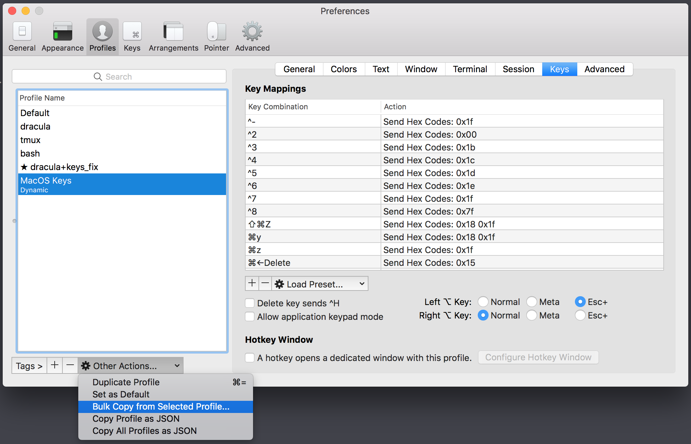
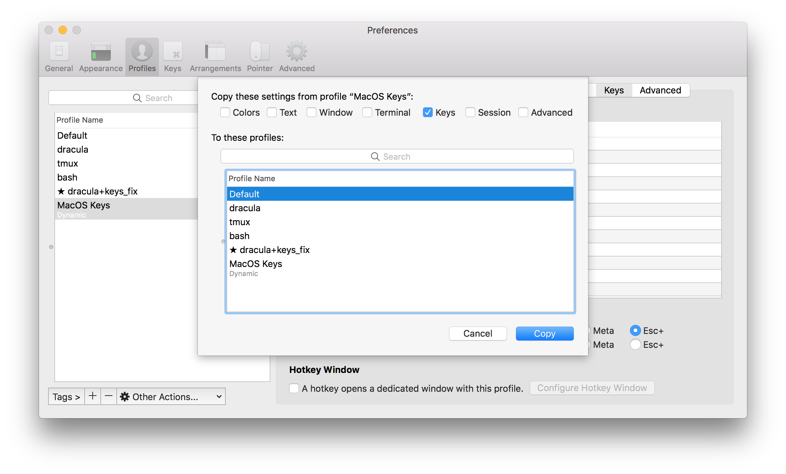

# Fix iterm2 MacOS keys

[](https://travis-ci.com/GabLeRoux/iterm2-macos-dynamic-profile)

iTerm2 has terrible defaults concerning `option + arrow`, `cmd + arrow` + `backspace` or `delete`. Here's a fixed _dynamic profile_ to fix that.

Refer to [iTerm 2: How to set keyboard shortcuts to jump to beginning/end of line? Answer](https://stackoverflow.com/a/29403520/1092815).

I followed instructions, took the first suggestion each time and generated this iTerm2 profile.

## How to import dynamic profile

```bash
git clone https://github.com/GabLeRoux/iterm2-macos-dynamic-profile.git
cd iterm2-macos-dynamic-profile

# copy the json profile to dynamic profiles folder
cp ./fix-iterm2-keys-profile.json ~/Library/Application\ Support/iTerm2/DynamicProfiles

# or create a symlink for easier updates
ln -s $(pwd)/fix-iterm2-keys-profile.json ~/Library/Application\ Support/iTerm2/DynamicProfiles/
```

* Open iTerm2 Preferences -> Profiles
* Select the new dynamic profile from the list
* Click `Other Actions` -> `Bulk Copy from Selected Profile...`
* Check `Keys` checkbox
* Select your profile
* Hit Copy button
* Enjoy a much better life with your keyboard





## ZSH bindkey fix + redo

As explained in [iTerm 2: How to set keyboard shortcuts to jump to beginning/end of line? Answer](https://stackoverflow.com/a/29403520/1092815):

See [`./fix_zsh_keys.sh`](./fix_zsh_keys.sh)

```bash
# Copy fixed keys to your dotfiles
mkdir ~/dotfiles/
cp ./fix_zsh_keys.sh ~/dotfiles/

# Add entry to your ~/.zshrc
echo 'source ~/dotfiles/fix_zsh_keys.sh' >> ~/.zshrc

# Reload your .zshrc for changes to take effect
source ~/.zshrc
```

## Related documentation

See [iterm2 dynamic profiles documentation](https://www.iterm2.com/documentation-dynamic-profiles.html) for more details.

## License

[MIT](LICENSE.md) © [Gabriel Le Breton](https://gableroux.com)

